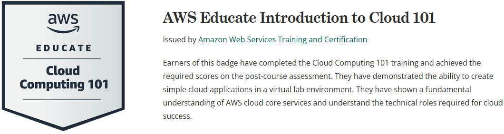

# AWS Cloud Introduction 🚀

This repository documents my progress and learnings from the two foundational AWS Educate modules:

- ✅ Introduction to the AWS Management Console  
- ✅ Introduction to Cloud 101

These courses are designed to help students and beginners understand the fundamentals of cloud computing and get hands-on with the AWS platform.

---

## 📚 Modules Overview

### 1. Introduction to the AWS Management Console
- Navigated and explored AWS services via the AWS Management Console
- Learned about core services such as:
  - **Amazon S3 (Simple Storage Service)**: Scalable object storage for data backup, archiving, and analytics.
  - **Amazon EC2 (Elastic Compute Cloud)**: Virtual servers in the cloud for running applications.
- Used the interactive AWS Educate environment to practice in a sandboxed console

### 2. Introduction to Cloud 101
- Covered the fundamentals of cloud computing:
  - Benefits of cloud vs traditional computing
  - Types of cloud deployments (Public, Private, Hybrid)
  - Cloud service models: **IaaS**, **PaaS**, **SaaS**
- Explored real-world examples of cloud usage in various industries

---

## 📸 Badge Earned

I successfully completed both modules and earned a digital badge:

[Link](https://www.credly.com/badges/253b9c35-2abc-466d-b401-35e0f2d2f628)

---

## 🔗 Useful Links

- [AWS Educate](https://www.awseducate.com/)
- [AWS Console](https://console.aws.amazon.com/)
- [Amazon S3 Documentation](https://docs.aws.amazon.com/s3/)
- [Amazon EC2 Documentation](https://docs.aws.amazon.com/ec2/)

---

## 🧠 Next Steps

I will continue learning AWS with more advanced modules such as:
- Machine Learning Foundations on AWS
- Introduction to Generative AI
- Getting Started with EC2, S3, and Lambda

Stay tuned for updates and new hands-on projects.

